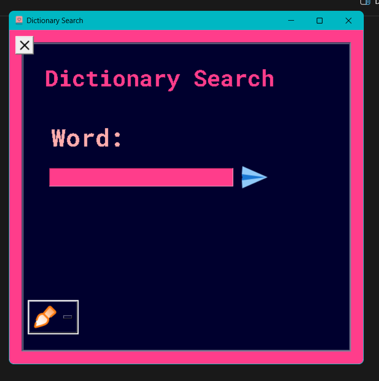

# DICTIONARY SEARCH GUI
---

- Made With Tkinter

##  How to Use!

- click Dictionary.exe

```shell
pip3 install -r requirements.txt

```
 
### EXAMPLE: 




>**Icons are used from [icons8.com](https://icons8.com)**